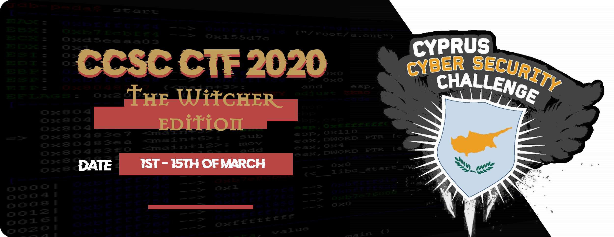

## Repository Structure

This is the official repository with the challenges published in CCSC CTF 2020. Each challenge has a `public` and `setup` folder (if applicable) and is accompanied with a short description. The `setup` folder contains all the files required to build and host the challenge and usually contains the flag and a proof of concept solution as well. Alternatively, the `public` folder contains the files that are released to the participant during the competition.

## Dependencies

Although some of the challenges may run as is, it is recommended that you have **docker** and **docker-compose** installed and use the provided scripts to run the challenges to ensure isolation and therefore proper environment setup.

## Challenges

### Crypto

| Name                                                                                                                      | Points | Author             |
| ------------------------------------------------------------------------------------------------------------------------- | ------ | ------------------ |
| [basilisk64](https://github.com/apogiatzis/CCSC-CTF-2020/tree/master/crypto/basilisk64)                                   | 50     | koks               |
| [Calanthe's Secrets](https://github.com/apogiatzis/CCSC-CTF-2020/tree/master/crypto/calanthes-secrets)                    | 250    |  _Roko'sBasilisk\_ |
| [Djinn Exorcism](https://github.com/apogiatzis/CCSC-CTF-2020/tree/master/crypto/djinn-exorcism)                           | 300    | \_Roko'sBasilisk\_ |
| [EClectic DisHonor](https://github.com/apogiatzis/CCSC-CTF-2020/tree/master/crypto/eclectic-dishonor)                     | 250    | koks               |
| [Mousesack's Spell](https://github.com/apogiatzis/CCSC-CTF-2020/tree/master/crypto/mousesacks-spell)                      | 150    | \_Roko'sBasilisk\_ |
| [Rivia Scala Aldersberg](https://github.com/apogiatzis/CCSC-CTF-2020/tree/master/crypto/rivia-scala-aldersberg)           | 150    | koks               |
| [Routes from Sodden to Amell](https://github.com/apogiatzis/CCSC-CTF-2020/tree/master/crypto/routes-from-sodden-to-amell) | 450    | \_Roko'sBasilisk\_ |

### Forensics

| Name                                                                                                               | Points | Author      |
| ------------------------------------------------------------------------------------------------------------------ | ------ | ----------- |
| [Abnormal Communication](https://github.com/apogiatzis/CCSC-CTF-2020/tree/master/forensics/abnormal_communication) | 150    | kotsios     |
| [Noonwraith's a hacker]()                                                                                          | 175    | v4kk15      |
| [Royal huntsman's Dump](https://github.com/apogiatzis/CCSC-CTF-2020/tree/master/forensics/royal-huntsman's-dump)   | 150    | s1kk1s      |
| [Much more than echoes](https://github.com/apogiatzis/CCSC-CTF-2020/tree/master/forensics/much_more_than_echoes)   | 250    | anderson101 |

### Misc

| Name                                                                                                    | Points | Author                       |
| ------------------------------------------------------------------------------------------------------- | ------ | ---------------------------- |
| [Jaskier Bot](https://github.com/apogiatzis/CCSC-CTF-2020/tree/master/misc/jaskier-bot)                 | 250    | \_Roko'sBasilisk\_ && s1kk1s |
| [The Last Wish](https://github.com/apogiatzis/CCSC-CTF-2020/tree/master/misc/the-last-wish)             | 100    | koks                         |
| [Every Minute Counts](https://github.com/apogiatzis/CCSC-CTF-2020/tree/master/misc/every-minute-counts) | 50     | koks                         |

### Pwn

| Name                                                                                     | Points | Author             |
| ---------------------------------------------------------------------------------------- | ------ | ------------------ |
| [Spell Caster](https://github.com/apogiatzis/CCSC-CTF-2020/tree/master/pwn/spell-caster) | 300    | \_Roko'sBasilisk\_ |
| [Guy de Bois](https://github.com/apogiatzis/CCSC-CTF-2020/tree/master/pwn/guy-de-bois)   | 200    | \_Roko'sBasilisk\_ |

### Stego

| Name                                                                                                                     | Points | Author      |
| ------------------------------------------------------------------------------------------------------------------------ | ------ | ----------- |
| [Golem](https://github.com/apogiatzis/CCSC-CTF-2020/tree/master/stego/golem)                                             | 50     | koks        |
| [Secret Message](https://github.com/apogiatzis/CCSC-CTF-2020/tree/master/stego/secret-message)                           | 100    | S1kk1S      |
| [The Map](https://github.com/apogiatzis/CCSC-CTF-2020/tree/master/stego/the_map)                                         | 100    | superhedgy  |
| [The Striga](https://github.com/apogiatzis/CCSC-CTF-2020/tree/master/stego/the_striga)                                   | 150    | andr0sn     |
| [Yennefer's Curse](https://github.com/apogiatzis/CCSC-CTF-2020/tree/master/stego/yennefers-curse)                        | 150    | andr0sn     |
| [Those are dangerous streams](https://github.com/apogiatzis/CCSC-CTF-2020/tree/master/stego/those_are_dangerous_streams) | 100    | anderson101 |

### Mobile

| Name                                                                                              | Points | Author |
| ------------------------------------------------------------------------------------------------- | ------ | ------ |
| [Treasure Hunting](https://github.com/apogiatzis/CCSC-CTF-2020/tree/master/mobile/threat-hunting) | 350    | v4kk15 |

### Web

| Name                                                                                                       | Points | Author             |
| ---------------------------------------------------------------------------------------------------------- | ------ | ------------------ |
| [0potion](https://github.com/apogiatzis/CCSC-CTF-2020/tree/master/web/0potion)                             | 300    | koks               |
| [Just Wraith Trouble](https://github.com/apogiatzis/CCSC-CTF-2020/tree/master/web/just-wraith-trouble)     | 150    | koks               |
| [Robomutant](https://github.com/apogiatzis/CCSC-CTF-2020/tree/master/web/robomutant)                       | 50     | koks               |
| [SSRunestone Finder](https://github.com/apogiatzis/CCSC-CTF-2020/tree/master/web/ssrunestone-finder)       | 350    | \_Roko'sBasilisk\_ |
| [Witcher Training Camp](https://github.com/apogiatzis/CCSC-CTF-2020/tree/master/web/witcher-training-camp) | 250    | \_Roko'sBasilisk\_ |
| [Welcome](https://github.com/apogiatzis/CCSC-CTF-2020/tree/master/web/welcome)                             | 50     | kotsios            |
