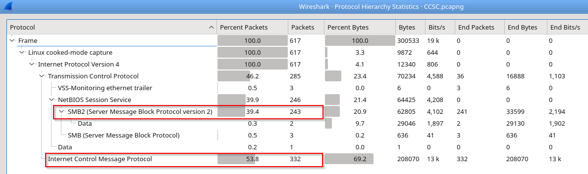
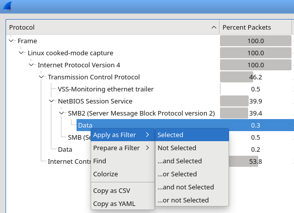
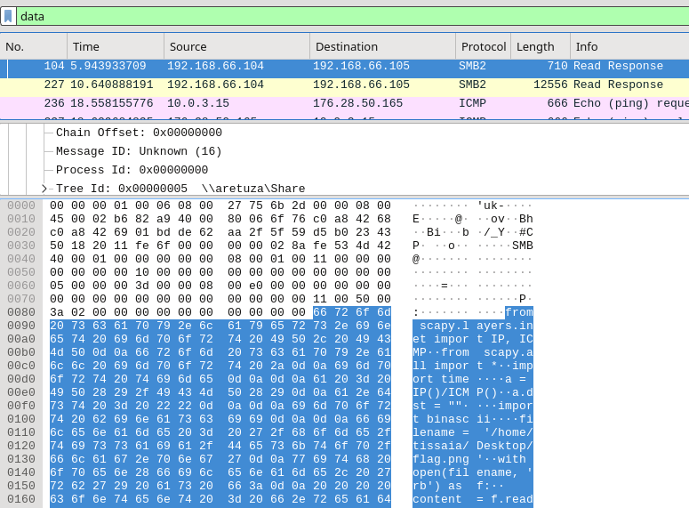
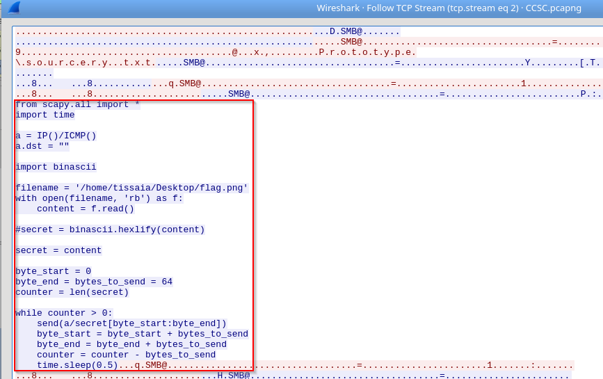
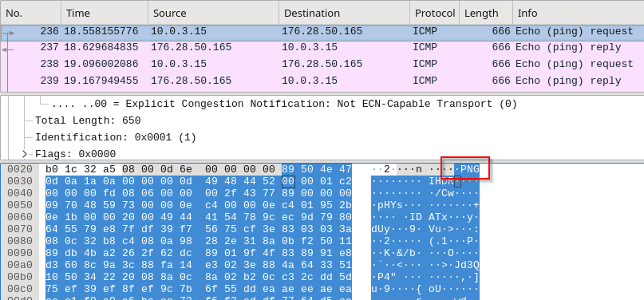
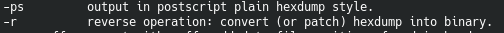

# Much more than echoes
**Category:** Network, Forensics
**Author:** anderson101

# Description
Tisaia has sent disguised message out of Aretuza. Gerad who has been watching her for some time, has intercepted this communication. Can he understand the meaning of all this SOURCEry?

# Points
250

# Solution

###### Hint (optional): "Look at those pings. Many pings, sent for what?
###### Flag: ccsc{Pings_are_the_most_dangarous_things_in_this_world}

A packet capture is provided for analysis and extraction of the hidden flag.
Analysing the protocols found in this capture (from Statistics > Protocol Hierarchy), two protocols are found to have the highest utilization percentage: SMB2 and ICMP

 
Starting with SMB2 protocol, we apply a filter on the data portion:

 
On the main window, two SMB2 “Read Response” appear. Examining packet #104 data portion, we notice a python script (this file was read by accessing the file sourcery.txt on a remote machine \\aretuza\share\prototype) 

To extract the source code we either copy the data portion to a text editor or by right clicking on packet #104 > Follow > TCP Stream

 
The above script does the following
	- 1.	Imports scapy library
	- 2.	Reads a file (flag.png)
	- 3.	Uses scapy library to craft ICMP packets. The payload of these packets is the flag.png bytes (split into 64 bytes in the above example).

###### NOTE
Packet #227, the second “Read Response” contains a PNG file in the data portion. This file, named flag.png, was located on the same folder as the python script under the folder Prototype. This is NOT the flag but a file used as a decoy.
*The real flag can be obtained by extracting the data portion of all ICMP request packets.

By examining the first ICMP request (packet #236), we identify that the data portion does not contain a standard data format generated by an operating system. In this case the first packet contains a PNG signature in the data portion.

As the python script suggests, ICMP echo requests were used send the PNG file (broken into chunks) to a remote host. We need to use the following command to extract the data field of all ICMP packets with source address 10.0.3.15
tshark -r CCSC.pcapng -Y "icmp && ip.src == 10.0.3.15" -T fields -e data
The output of the above command is in hexadecimal format. In order to use the data and be able to read the PNG file that contains the flag, we need to convert the hexadecimal value into a binary.
We can perform this by piping the output to xxd program using the –r –p options

 
tshark -r CCSC.pcapng -Y "icmp && ip.src == 10.0.3.15" -T fields -e data | xxd -r -ps > flag

A file should appear with the reassembled bytes into a PNG image. Opening the image reveals the flag

