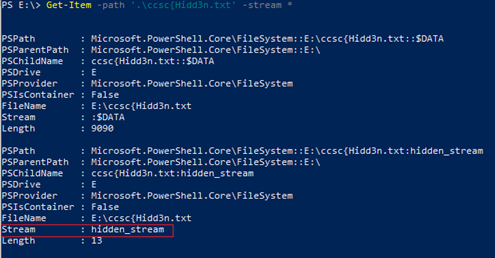

# Those are dangerous streams

**Category:** Stego

**Author:** anderson101

# Description
... We hid the treasure, and hid it good - no one's gonna find it, not in a million years. Writing exactly where and how would be plain foolish...

# Points
100

### Hint: Those streams are alternative
### Flag: ccsc{Hidd3n_In_the_D3pth5}

# Solution: 

1.	A text file containing the flag is stored in a virtual hard drive “Njall.vhdx” formatted in NTFS (required to preserve the file stream)
2.	Once the VHDX is mounted, a text file containing the flag (3 pieces) can be accessed
  - a.	Part 1: File name: “ccsc{Hidd3n”
  - b.	Part 2: Content of the file: “_In_the”
  - c.	Part 3: Alternate data stream. The last part can be obtained by the following two PowerShell commands

Get the streams of a specified file

Get the stream contents of a file

